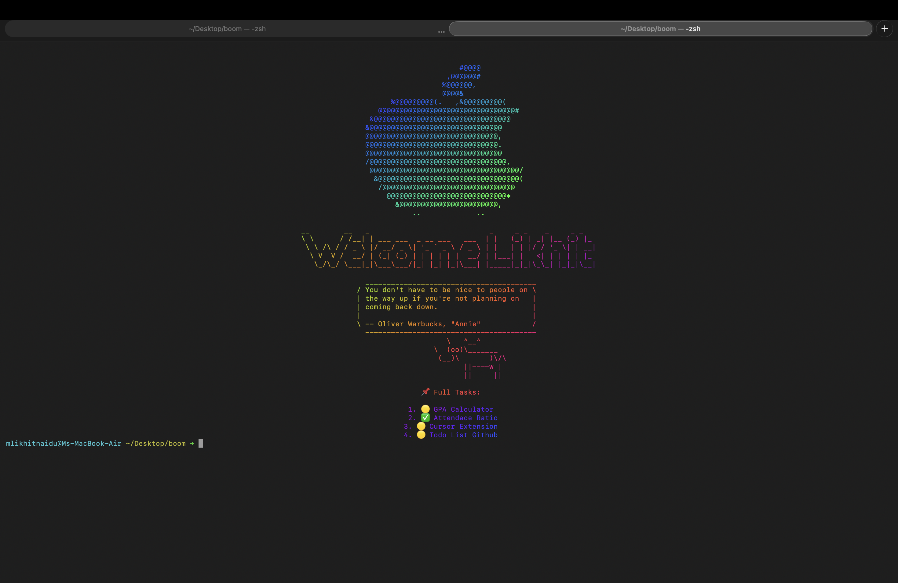

# 🖥️ Terminal TODO System (Zsh + fzf + ASCII UI)

A fast, minimal, and fully customizable **terminal-based TODO manager** for macOS using Zsh.

This setup gives you:

* Interactive task selection (`fzf`)
* Persistent storage
* Auto-display on terminal startup
* Centered + styled output
* Large ASCII task highlighting

---

## ⚙️ Features

* ✅ Add, delete, complete tasks
* 🔍 Interactive selection with `fzf`
* 🎨 Styled terminal UI (centered + colored)
* 🔥 Highlight top tasks in large ASCII text
* 🚀 Auto-display tasks on terminal launch

---


## 📦 Requirements

Install dependencies using Homebrew:

```bash
brew install fzf figlet lolcat cowsay fortune
```

---

## 📁 Setup

### 1. Create TODO file

```bash
touch ~/.todo
```

---

### 2. Create TODO script

```bash
nano ~/todo.sh
```

Paste:

```bash
#!/bin/bash

TODO_FILE="$HOME/.todo"

case "$1" in
  add)
    shift
    echo "[ ] $*" >> "$TODO_FILE"
    ;;
    
  list)
    nl -w2 -s'. ' "$TODO_FILE"
    ;;
    
  done)
    line=$(nl -w2 -s'. ' "$TODO_FILE" | fzf | cut -d'.' -f1)
    if [ -n "$line" ]; then
      sed -i '' "${line}s/\[ \]/[x]/" "$TODO_FILE"
    fi
    ;;
    
  delete)
    line=$(nl -w2 -s'. ' "$TODO_FILE" | fzf | cut -d'.' -f1)
    if [ -n "$line" ]; then
      sed -i '' "${line}d" "$TODO_FILE"
    fi
    ;;
    
  *)
    echo "Usage: todo {add|list|done|delete}"
    ;;
esac
```

Make executable:

```bash
chmod +x ~/todo.sh
```

---

### 3. Add alias

```bash
nano ~/.zshrc
```

Add:

```bash
alias todo="~/todo.sh"
```

Reload:

```bash
source ~/.zshrc
```

---

## 🚀 Usage

### Add task

```bash
todo add "Build AI PPT generator"
```

### List tasks

```bash
todo list
```

### Mark task as done (interactive)

```bash
todo done
```

### Delete task (interactive)

```bash
todo delete
```

---

## 🎨 Terminal UI Customization

Edit your `.zshrc`:

```bash
nano ~/.zshrc
```

Add this section:

```bash
clear

cat ~/.apple_logo | ~/.center | lolcat
figlet "Welcome Likhit" | ~/.center | lolcat
fortune | cowsay | ~/.center | lolcat

echo "\n🔥 Top Tasks:\n" | ~/.center | lolcat
grep "\[ \]" ~/.todo | head -3 | while read line; do
  figlet "$line" | ~/.center | lolcat
done

echo "\n📌 Full Tasks:\n" | ~/.center | lolcat
nl -w2 -s'. ' ~/.todo | sed 's/\[ \]/🟡/; s/\[x\]/✅/' | ~/.center | lolcat
```

Reload:

```bash
source ~/.zshrc
```

---

## 🧠 How It Works

* Tasks stored in `~/.todo`
* `[ ]` = pending, `[x]` = completed
* `fzf` enables interactive selection
* `figlet` creates large ASCII text
* `.zshrc` runs automatically on terminal launch

---

## 🔧 Optional Improvements

* Add priorities:

  ```
  [ ] (HIGH) Finish project
  ```

* Show only pending tasks:

  ```bash
  grep "\[ \]" ~/.todo
  ```

* Add notifications:

  ```bash
  osascript -e 'display notification "Task pending"'
  ```

* Sync with Git:

  ```bash
  cd ~ && git init
  ```

---

## ⚠️ Limitations

* Terminal cannot change font size per line
* ASCII (`figlet`) is used to simulate large text
* No GUI (by design)

---

## 💡 Future Upgrades

* Full-screen TUI using Python (`curses` / `textual`)
* Task deadlines + sorting
* Cross-device sync
* Keyboard shortcuts for faster workflow

---


## 🚫 Reality Check

If you don’t use this daily, the problem isn’t the tool.

It’s your execution.
